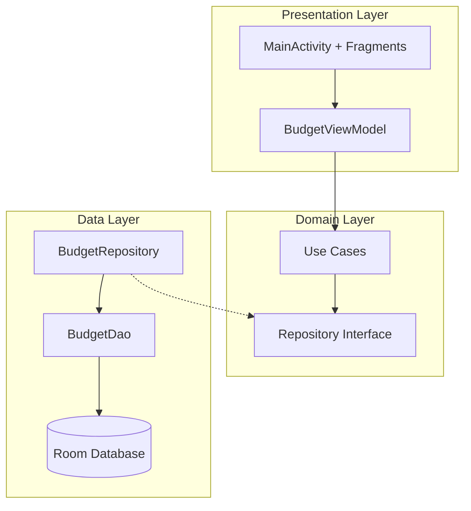

# Design Document - 简洁资金管理安卓应用

## Overview

本设计文档描述了一个简洁的安卓资金管理应用的技术架构和实现方案。该应用采用类似计算器的简洁界面设计，专注于核心功能：月度可支配资金管理、计划支出跟踪和剩余金额实时计算。

### 技术栈选择

- **开发语言**: Kotlin (Android官方推荐语言)
- **架构模式**: MVVM (Model-View-ViewModel) 
- **数据库**: Room Persistence Library (SQLite抽象层)
- **UI框架**: Material Design 3 组件
- **依赖注入**: Hilt (Google推荐的DI框架)
- **异步处理**: Kotlin Coroutines + Flow
- **最低SDK版本**: API 24 (Android 7.0) - 覆盖95%+设备

### 设计原则

1. **简洁性**: 界面设计遵循计算器风格，避免复杂的导航和多余功能
2. **响应性**: 使用Material Design 3的自适应布局，支持不同屏幕尺寸
3. **可靠性**: 本地数据存储确保离线可用，数据持久化保证不丢失
4. **可维护性**: 清晰的架构分层，便于测试和扩展

## Architecture

### 整体架构图



### MVVM架构详解

**View Layer (UI)**
- `MainActivity`: 主活动，承载Fragment容器
- `BudgetFragment`: 主界面Fragment，显示预算信息和操作按钮
- `ExpenseListFragment`: 支出列表Fragment，管理支出项目

**ViewModel Layer**
- `BudgetViewModel`: 管理UI状态和业务逻辑
- 使用`StateFlow`和`LiveData`进行数据绑定
- 处理用户交互并调用Use Cases

**Model Layer**
- `BudgetRepository`: 数据访问抽象层
- `Room Database`: 本地数据持久化
- `Entity Classes`: 数据模型定义

### 数据流设计

1. **用户输入** → UI组件捕获事件
2. **事件处理** → ViewModel接收并验证输入
3. **业务逻辑** → Use Cases执行具体业务操作
4. **数据操作** → Repository调用DAO进行数据库操作
5. **状态更新** → 通过Flow/LiveData更新UI状态
6. **UI刷新** → View层响应状态变化更新界面

## Components and Interfaces

### 核心组件设计

#### 1. 数据库组件

**BudgetDatabase (Room Database)**
```kotlin
@Database(
    entities = [BudgetPeriod::class, Expense::class],
    version = 1,
    exportSchema = false
)
abstract class BudgetDatabase : RoomDatabase() {
    abstract fun budgetDao(): BudgetDao
}
```

**BudgetDao (数据访问对象)**
```kotlin
@Dao
interface BudgetDao {
    @Query("SELECT * FROM budget_periods ORDER BY created_date DESC LIMIT 1")
    fun getCurrentBudgetPeriod(): Flow<BudgetPeriod?>
    
    @Query("SELECT * FROM expenses WHERE budget_period_id = :periodId")
    fun getExpensesForPeriod(periodId: Long): Flow<List<Expense>>
    
    @Insert
    suspend fun insertBudgetPeriod(period: BudgetPeriod): Long
    
    @Insert
    suspend fun insertExpense(expense: Expense)
    
    @Delete
    suspend fun deleteExpense(expense: Expense)
}
```

#### 2. UI组件

**主界面布局设计**
- 使用`ConstraintLayout`作为根布局
- 顶部显示剩余金额的大号数字（类似计算器显示屏）
- 中部显示发薪日倒计时
- 底部使用`Material3 Button`组件的网格布局
- 支出列表使用`RecyclerView`实现

**Material Design 3组件选择**
- `TextInputLayout` + `TextInputEditText`: 金额输入
- `MaterialButton`: 操作按钮
- `MaterialCardView`: 支出项目卡片
- `FloatingActionButton`: 添加支出的主要操作
- `MaterialAlertDialog`: 确认对话框

#### 3. ViewModel组件

**BudgetViewModel状态管理**
```kotlin
class BudgetViewModel @Inject constructor(
    private val budgetRepository: BudgetRepository
) : ViewModel() {
    
    private val _uiState = MutableStateFlow(BudgetUiState())
    val uiState: StateFlow<BudgetUiState> = _uiState.asStateFlow()
    
    private val _remainingAmount = MutableStateFlow(0.0)
    val remainingAmount: StateFlow<Double> = _remainingAmount.asStateFlow()
    
    private val _daysUntilPayday = MutableStateFlow(0)
    val daysUntilPayday: StateFlow<Int> = _daysUntilPayday.asStateFlow()
}
```

### 接口设计

#### Repository接口
```kotlin
interface BudgetRepository {
    fun getCurrentBudgetPeriod(): Flow<BudgetPeriod?>
    fun getExpensesForCurrentPeriod(): Flow<List<Expense>>
    suspend fun createNewBudgetPeriod(disposableAmount: Double): Result<Long>
    suspend fun addExpense(description: String, amount: Double): Result<Unit>
    suspend fun deleteExpense(expenseId: Long): Result<Unit>
    suspend fun resetBudgetPeriod(): Result<Unit>
}
```

#### Use Cases接口
```kotlin
interface CalculateRemainingAmountUseCase {
    suspend operator fun invoke(): Flow<Double>
}

interface CalculateDaysUntilPaydayUseCase {
    suspend operator fun invoke(): Flow<Int>
}

interface AddExpenseUseCase {
    suspend operator fun invoke(description: String, amount: Double): Result<Unit>
}
```

## Data Models

### 实体类设计

#### BudgetPeriod (预算周期)
```kotlin
@Entity(tableName = "budget_periods")
data class BudgetPeriod(
    @PrimaryKey(autoGenerate = true)
    val id: Long = 0,
    
    @ColumnInfo(name = "disposable_amount")
    val disposableAmount: Double,
    
    @ColumnInfo(name = "created_date")
    val createdDate: Long = System.currentTimeMillis(),
    
    @ColumnInfo(name = "payday_date")
    val paydayDate: Long = System.currentTimeMillis() + (30 * 24 * 60 * 60 * 1000L), // 30天后
    
    @ColumnInfo(name = "is_active")
    val isActive: Boolean = true
)
```

#### Expense (支出项目)
```kotlin
@Entity(
    tableName = "expenses",
    foreignKeys = [ForeignKey(
        entity = BudgetPeriod::class,
        parentColumns = ["id"],
        childColumns = ["budget_period_id"],
        onDelete = ForeignKey.CASCADE
    )]
)
data class Expense(
    @PrimaryKey(autoGenerate = true)
    val id: Long = 0,
    
    @ColumnInfo(name = "budget_period_id")
    val budgetPeriodId: Long,
    
    @ColumnInfo(name = "description")
    val description: String,
    
    @ColumnInfo(name = "amount")
    val amount: Double,
    
    @ColumnInfo(name = "created_date")
    val createdDate: Long = System.currentTimeMillis()
)
```

### UI状态模型

#### BudgetUiState
```kotlin
data class BudgetUiState(
    val isLoading: Boolean = false,
    val currentBudgetPeriod: BudgetPeriod? = null,
    val expenses: List<Expense> = emptyList(),
    val remainingAmount: Double = 0.0,
    val daysUntilPayday: Int = 0,
    val isOverBudget: Boolean = false,
    val errorMessage: String? = null
)
```

### 数据验证规则

1. **金额验证**: 必须为正数，最多保留2位小数
2. **描述验证**: 不能为空，最大长度50字符
3. **日期验证**: 发薪日必须在当前日期之后
4. **数据完整性**: 外键约束确保数据一致性

## Error Handling

### 错误分类和处理策略

#### 1. 数据库错误
- **SQLiteException**: 数据库操作失败
- **处理方式**: 记录日志，显示用户友好的错误信息，提供重试选项
- **恢复策略**: 自动重试机制，数据库损坏时重建数据库

#### 2. 输入验证错误
- **无效金额**: 显示输入格式提示
- **空描述**: 高亮必填字段
- **处理方式**: 实时验证，即时反馈

#### 3. 业务逻辑错误
- **预算周期不存在**: 引导用户创建新周期
- **重复操作**: 防抖处理，避免重复提交

#### 4. 系统级错误
- **内存不足**: 优化数据加载，分页处理
- **存储空间不足**: 提示用户清理空间

### 错误处理实现

```kotlin
sealed class BudgetError : Exception() {
    object DatabaseError : BudgetError()
    object InvalidAmount : BudgetError()
    object EmptyDescription : BudgetError()
    object NoBudgetPeriod : BudgetError()
    data class NetworkError(val message: String) : BudgetError()
}

// Result包装类
sealed class Result<out T> {
    data class Success<T>(val data: T) : Result<T>()
    data class Error(val exception: BudgetError) : Result<Nothing>()
}
```

### 用户体验优化

1. **加载状态**: 使用Material Design的LoadingIndicator
2. **错误提示**: 使用Snackbar显示非阻塞式错误信息
3. **确认对话框**: 重要操作前显示确认对话框
4. **离线支持**: 所有功能均支持离线使用

## Testing Strategy

### 测试金字塔结构

#### 1. 单元测试 (70%)
**目标组件**:
- ViewModel逻辑测试
- Use Cases业务逻辑测试
- Repository数据操作测试
- 工具类和扩展函数测试

**测试框架**:
- JUnit 5
- MockK (Kotlin mocking框架)
- Kotlin Coroutines Test
- Truth (Google断言库)

**测试示例**:
```kotlin
@Test
fun `calculate remaining amount should return correct value`() = runTest {
    // Given
    val budgetPeriod = BudgetPeriod(disposableAmount = 1000.0)
    val expenses = listOf(
        Expense(amount = 200.0),
        Expense(amount = 150.0)
    )
    
    // When
    val result = calculateRemainingAmountUseCase(budgetPeriod, expenses)
    
    // Then
    assertThat(result).isEqualTo(650.0)
}
```

#### 2. 集成测试 (20%)
**目标组件**:
- Room数据库操作测试
- Repository与DAO集成测试
- ViewModel与Repository集成测试

**测试框架**:
- Room Testing
- Hilt Testing
- AndroidX Test

#### 3. UI测试 (10%)
**目标组件**:
- 用户交互流程测试
- 界面状态变化测试
- 错误场景处理测试

**测试框架**:
- Espresso
- UI Automator
- Compose Testing (如果使用Jetpack Compose)

### 测试数据管理

1. **测试数据库**: 使用内存数据库进行测试
2. **测试数据工厂**: 创建标准化的测试数据
3. **测试隔离**: 每个测试独立运行，避免相互影响

### 持续集成

1. **自动化测试**: 代码提交时自动运行所有测试
2. **代码覆盖率**: 目标覆盖率80%以上
3. **性能测试**: 定期进行应用性能基准测试

### 测试最佳实践

1. **Given-When-Then模式**: 结构化测试用例
2. **测试命名规范**: 使用描述性的测试方法名
3. **边界值测试**: 测试极限情况和边界条件
4. **错误路径测试**: 确保错误处理逻辑正确
